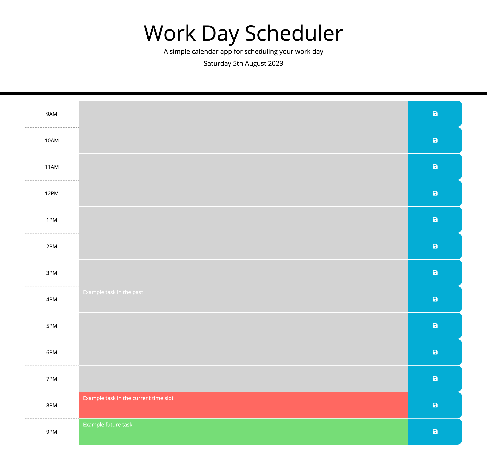

# Daily Planner

## Description

Submission for Module 7 of the University of Birmingham Skills Bootcamp in Front-End Web Development &amp; UX.

This assignment took a starter code package in commit [b5c6e41](https://github.com/Stefan4D/daily-planner/commit/b5c6e41c34ea9a33a6fd37a5a396a2dc8f2edf92) and developed it to meet the defined acceptance criteria.

The production website is deployed [here](https://stefan4d.github.io/daily-planner/).

This has been developed to meet the following Acceptance Criteria:

- Display the current day at the top of the calendar when a user opens the planner.
- Present timeblocks for standard business hours when the user scrolls down.
- Color-code each timeblock based on past, present, and future when the timeblock is viewed.
- Allow a user to enter an event when they click a timeblock.
- Save the event in local storage when the save button is clicked in that timeblock.
- Persist events between refreshes of a page.

## Learning Outcomes

- I learned how to use the JQuery core and UI libraries to rapidly prototype applications
- I learned about the .parent() and .siblings() methods in JQuery, which is a very useful way to grab an element in the DOM that is related to the parent of the current item (using the this keyword), which allowed me to succinctly delegate events and save changes made by the user
- I revisited flexbox in order to get the content to display correctly and mimic the example provided
- I learned how to get the time in a specific format from Day.js, which I was then able to use in my JSON object to easily store and retrieve events at particular time-slots

## Resources used

- [JQuery Docs: Siblings](https://api.jquery.com/siblings/)
- [Stack Overflow: Parent/Sibling selector](https://stackoverflow.com/questions/6577228/jquery-parent-sibling-selector)
- [Day.js: isAfter function](https://day.js.org/docs/en/query/is-after#docsNav)

## Mark Scheme Compliance

### Technical Acceptance Criteria

| Item                                                                                                       | Evidence                                                                                                                          |
| ---------------------------------------------------------------------------------------------------------- | --------------------------------------------------------------------------------------------------------------------------------- |
| Satisfies all of the above acceptance criteria and uses a date utility library to work with date and time. | The built application satisfies the acceptance criteria and uses Day.js and the advancedFormat plugin for handling date and time. |

### Deployment

| Item                                              | Evidence                                                                |
| ------------------------------------------------- | ----------------------------------------------------------------------- |
| Application deployed at live URL.                 | Live application deployed at: https://stefan4d.github.io/daily-planner/ |
| Application loads with no errors.                 | No visual defects   No console errors                              |
| Application GitHub URL submitted.                 | URL submitted                                                           |
| GitHub repository that contains application code. | This repository contains all code.                                      |

### Application Quality

| Item                                                                                    | Evidence                                                                                                                                       |
| --------------------------------------------------------------------------------------- | ---------------------------------------------------------------------------------------------------------------------------------------------- |
| Application user experience is intuitive and easy to navigate.                          | Application user interface matches the mock-up and uses intuitive elements e.g. click to add an item or edit, and a save icon to save changes. |
| Application user interface style is clean and polished.                                 | As above                                                                                                                                       |
| Application resembles the mock-up functionality provided in the Challenge instructions. | Application resembles the mock-up.                                                                                                             |

### Repository Quality

| Item                                                                                                    | Evidence                                                                                                                                                                                                                  |
| ------------------------------------------------------------------------------------------------------- | ------------------------------------------------------------------------------------------------------------------------------------------------------------------------------------------------------------------------- |
| Repository has a unique name.                                                                           | Unique name used                                                                                                                                                                                                          |
| Repository follows best practices for file structure and naming conventions.                            | Standard file naming conventions used                                                                                                                                                                                     |
| Repository follows best practices for class/id naming conventions, indentation, quality comments, etc.  | All multi-word variables in JavaScript use camelCase   Indentation within code follows best practice    Comments have been included within the files to describe behaviour and/or intent of the code. |
| Repository contains multiple descriptive commit messages.                                               | Multiple commits included demonstrating incremental build of final submission. Each has a clear description of changes made.                                                                                              |
| Repository contains quality README file with description, screenshot, and link to deployed application. | This README document.                                                                                                                                                                                                     |

## License

Released under the MIT license. Full details in [LICENSE](./LICENSE).
